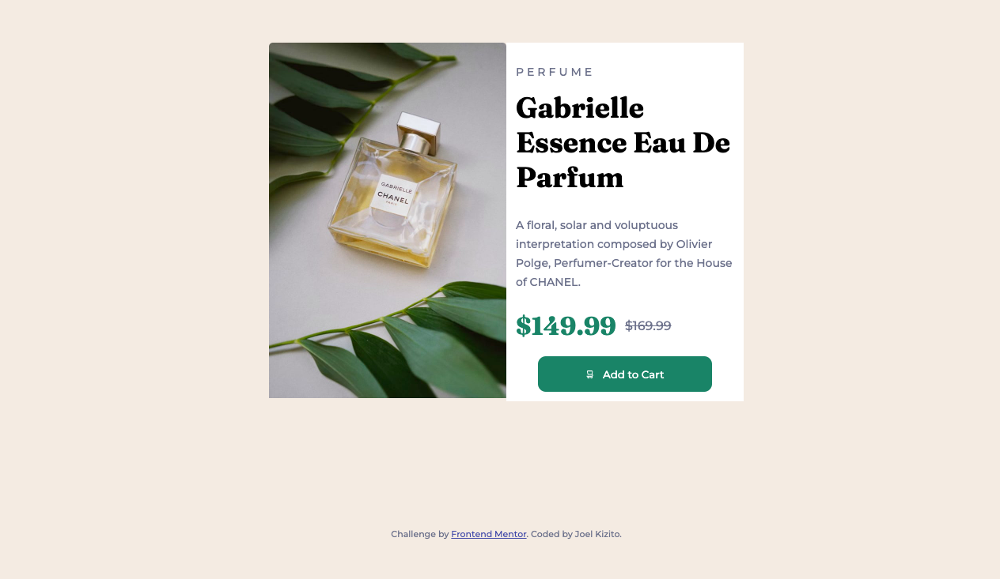

# Frontend Mentor - Product preview card component solution

Live Page: https://kizitojoel.github.io/product-review-card/


## Table of contents

- [Overview](#overview)
  - [The challenge](#the-challenge)
  - [Screenshot](#screenshot)
  - [Links](#links)
- [My process](#my-process)
  - [Built with](#built-with)
  - [What I learned](#what-i-learned)
  - [Continued development](#continued-development)
  - [Useful resources](#useful-resources)
- [Author](#author)

## Overview

### The challenge

Users should be able to:

- View the optimal layout depending on their device's screen size

### Screenshot
#### _Desktop Version_



#### _Mobile Version_


### Links

- Solution URL: https://github.com/kizitojoel/product-review-card
- Live Site URL: https://kizitojoel.github.io/product-review-card/

## My process

### Built with

- Semantic HTML5 markup
- CSS custom properties
- Flexbox
- CSS Grid
- Mobile-first workflow
- [Google Fonts](https://fonts.google.com/)


### What I learned

I delved deeper into mobile first workflow and learnt more about media queries. I learned about the four/five major device breakpoints to use which are:
- Mobile
- Tablet
- Laptop
- 4K Screen*

```html
<picture>
        <source media="(min-width: 700px)" srcset="images/image-product-desktop.jpg">
        <!-- <source media="(min-width: 300px)" srcset="images/image-product-mobile.jpg"> -->
        
</picture>
```
```css
@media screen and (min-width: 700px){
    body
    {
        height: 100vh;
        display: flex;
        flex-direction: column;
        justify-content: space-evenly;
    }
    .container{
        flex-direction: row;
        width: 600px;
        margin-top: auto;
        margin-bottom: auto;
    }
    .container-section
    {
        width: 50%;
        box-sizing: border-box;
    }
    .container-section:nth-of-type(2) > *
    {
        flex-grow: 1;
    }
```

### Continued development

I'd like to start integrating frontend software libraries such as Bootstrap among others into my work as I code beautiful websites

### Useful resources

- [CSS Reference.io](https://cssreference.io/property/letter-spacing/) - This helped me to discover css keywords for letter spacing.
- [W3C School](https://www.w3schools.com/css/css_rwd_mediaqueries.asp) - This is an amazing article which helped me finally understand CSS Breakpoints. I'd recommend it to anyone still learning this concept.

## Author

- GitHub - [Joel Kizito](https://github.com/kizitojoel)
- Frontend Mentor - [kizitojoel](https://www.frontendmentor.io/profile/kizitojoel)
